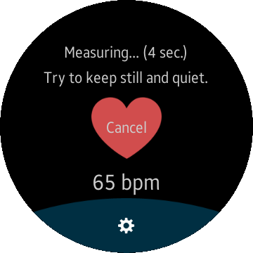
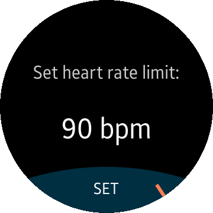

# HeartRateMonitor
HeartRateMonitor is a sample application that demonstrates how to obtain data provided by the HRM sensor (heart rate sensor) using [Tizen Sensor API](https://samsung.github.io/TizenFX/stable/api/Tizen.Sensor.html).

### Features
* Heart rate measurement
* Setting heart rate limit

### Author
* 
This app is a port of a [mobile app](/../../tree/master/Mobile/HeartRateMonitor) originally made by Dariusz Paziewski. The port was created by Jakub Troć.
