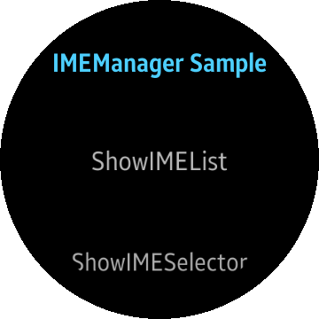

# IMEManager
This is a sample project for C# IME(Input Method Editor) manager Application, which demonstrates how to use InputMethodManager API. 
IMEManager is mainly designed for Tizen Wearable profile.

### Verified Version
* Xamarin.Forms : 3.4.0.1008975
* Tizen.NET : 5.0.0.14596
* Tizen.NET.SDK : 1.0.1

### Supported Profile
* Wearable

### Author
* Inhong Han (inhong1.han@samsung.com)
