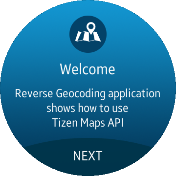
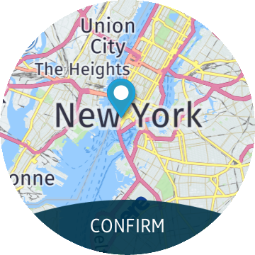
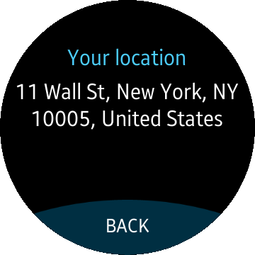

# Reverse Geocoding
Reverse Geocoding is a sample application that shows how to get address of selected geographical location using [Tizen Maps API](https://samsung.github.io/TizenFX/stable/api/Tizen.Maps.html).

### Features
* Translating geographical location selected on the map to address.

### Prerequisites
* [Visual Studio](https://www.visualstudio.com/) - Buildtool, IDE
* [Visual Studio Tools for Tizen](https://docs.tizen.org/application/vstools/install) - Visual Studio plugin for Tizen .NET application development
* [HERE Maps API Key](https://developer.here.com/plans) - API key from HERE maps is required to use the application

### Author
* Michal Lesniak
