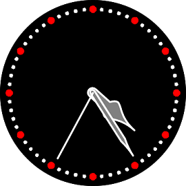

# SkiaSharp2DSample #

SkiaSharp2DSample app demonstrates how to use `SkiaSharp API` in Tizen Xamarin.Forms applications.

   

 - Drawing Basics (DrawCircle)
 - SkiaSharp Path (DrawPath)
 - SkiaSharp Transforms (Translate, Scale, RotateDegrees)

## SkiaSharp API
This application uses [SkiaSharp API](https://docs.microsoft.com/en-us/dotnet/api/SkiaSharp).

* [Class SKCanvas][SKCanvas]

   [SKCanvas]: <https://docs.microsoft.com/en-us/dotnet/api/skiasharp.skcanvas>

