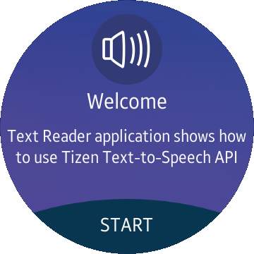
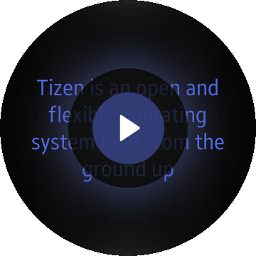

# TextReader
TextReader is a sample application which demonstrates how to use [Tizen.Uix.Tts](https://samsung.github.io/TizenFX/stable/api/Tizen.Uix.Tts.html) API.

### Features
* Paragraph items can be scrolled with bezel.

### Prerequisites

* [Visual Studio](https://www.visualstudio.com/) - Buildtool, IDE
* [Visual Studio Tools for Tizen](https://docs.tizen.org/application/vstools/install) - Visual Studio plugin for Tizen .NET application development

### Author
* Mateusz Szperna
