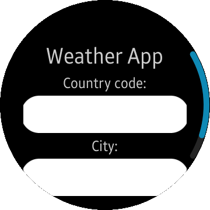
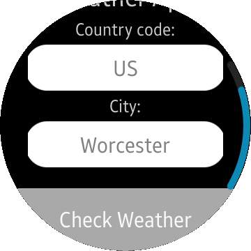
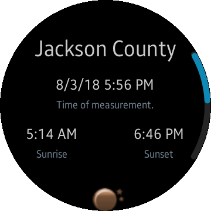
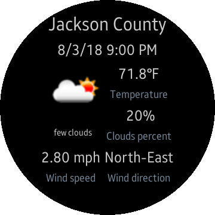

# Weather

This is a wearable port of [Weather](../../Mobile/Weather/) mobile app. 

Weather is a sample application that demonstrates how to obtain data provided by the RESTful API using the [OpenWeatherMap](<https://openweathermap.org/>) API.

### Features
* Checking current weather (sample includes some US cities, check included [json files](./Weather/Data/) for details).
* Checking forecast for next 5 days.

### Prerequisites
* [Visual Studio](https://www.visualstudio.com/) - Buildtool, IDE
* [Visual Studio Tools for Tizen](https://docs.tizen.org/application/vstools/install) - Visual Studio plugin for Tizen .NET application development
* [Tizen CircularUI](https://samsung.github.io/Tizen.CircularUI/guide/Quickstart.html)

### Author
* Original mobile app was created by Michał Kołodziejski
* Port to wearable by [@Piotr12](https://github.com/Piotr12)
