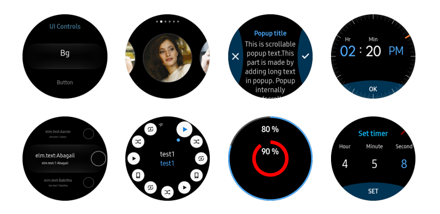

# XUIComponents
This sample application demonstrates how you can create an Tizen wearable Circle UI using Xamarin.Forms and [Tizen.Wearable.CircularUI.Forms](https://github.com/Samsung/Tizen.CircularUI).

### Verified Version
* Xamarin.Forms : 3.1.0.583944
* Tizen.Wearable.CircularUI 1.0.0-pre2-00078
* Tizen.NET : 4.0.0
* Tizen.NET.SDK : 1.0.1

### Supported Profile
* Wearable

### Author
* JeongKyun Pu, Pius Lee
